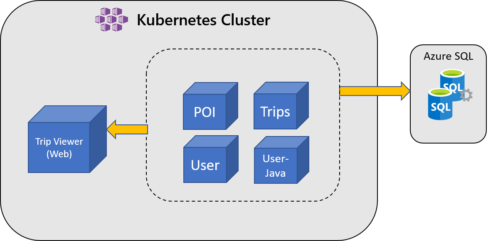

# Getting Ready for Orchestration

Containers are extremely useful on their own, but their flexibility and potential is multiplied when deployed to an orchestrator. Some of the advantages of deploying your containers to an orchestrator include:

- Deployment reliability
- Scaling on demand
- Better resource utilization and application density

Before getting into the details of what it takes to bring a cluster to production, your CTO would like you to first do a spike to validate your application can be deployed in a Kubernetes environment.

## Challenge

At this point, you've built the images for the components of your application and made those images available in your private ACR. Your team's goal in this challenge is to deploy your application to a test Azure Kubernetes Service (AKS) cluster in your Azure subscription.

Focus on making sure your containers are all up and can communicate and reach the necessary Azure services. In particular:

- `tripviewer` needs to be able to access the `trips` and `userprofile` services

    > Note: The Swagger API Documentation links on the homepage of `tripviewer` will not work at this time. You will add this functionality in a later challenge.

- Your POI and User (Java) APIs must be reachable (even though they are not accessed by the Trip Viewer application at this stage). Refer to the application documentation for ways to test the endpoints.

    > Note: There's no need to give each API an external IP.

- All APIs must be able to access the SQL database provided in your Azure subscription. Connection details can be found in the **Messages** tab of your OpenHack portal.

## Desired Architecture

Services will all run in the kubernetes cluster with the TripViewer application making calls to the APIs to get data. Data is stored on an Azure SQL Server which is accessed by the APIs.

## Success Criteria

- **Your team** successfully created an AKS cluster in Azure
- **Your team** must demonstrate that at least one pod for each component of the TripInsights application is running
- **Your team** must demonstrate that the components in your cluster can connect to other components or resources:
    - `tripviewer` is able to access the `trips` and `userprofile` services
    - All APIs are able to access the SQL database provided in your Azure subscription
    - The POI and User (Java) APIs are reachable from the TripViewer web app top links (but the APIs do not have to be accessible from outside the AKS cluster)

## References

Kubernetes:

- [Kubernetes core concepts](https://docs.microsoft.com/en-us/azure/aks/concepts-clusters-workloads)
- [Kubernetes services](https://kubernetes.io/docs/concepts/services-networking/connect-applications-service/)
- [Kubernetes DNS for services and pods](https://kubernetes.io/docs/concepts/services-networking/dns-pod-service/)
- [Kubernetes Port Forwarding](https://kubernetes.io/docs/tasks/access-application-cluster/port-forward-access-application-cluster/)
- [Kubernetes External Load Balancers](https://kubernetes.io/docs/tasks/access-application-cluster/create-external-load-balancer/)
- [Kubectl overview](https://kubernetes.io/docs/user-guide/kubectl-overview/)

Azure Kubernetes Service (AKS)

- [Deploy an AKS cluster using Azure CLI](https://docs.microsoft.com/en-us/azure/aks/kubernetes-walkthrough)
- [Azure CLI: az aks create](https://docs.microsoft.com/en-us/cli/azure/aks?view=azure-cli-latest#az-aks-create)
- [Deploy an AKS cluster using the Azure portal](https://docs.microsoft.com/en-us/azure/aks/kubernetes-walkthrough-portal)

Azure Container Registry (ACR)

- [Authenticate with ACR from AKS](https://docs.microsoft.com/en-us/azure/container-registry/container-registry-auth-aks)

Azure

- [Azure CLI reference](https://docs.microsoft.com/en-us/cli/azure/get-started-with-azure-cli)
- [Resource naming conventions](https://docs.microsoft.com/en-us/azure/architecture/best-practices/naming-conventions)
